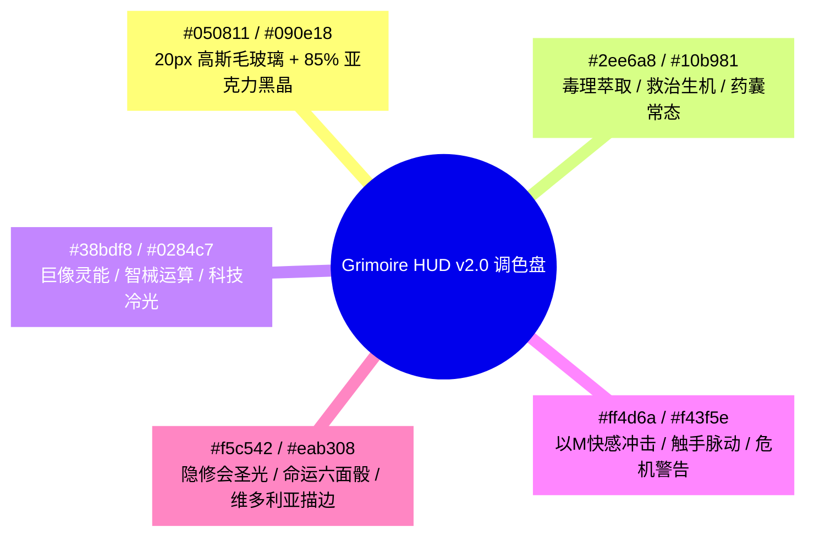
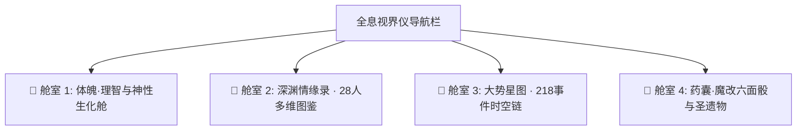

# 《诡异药剂师》殿堂级前端视界仪 (Grimoire HUD v2.0) 重构实施计划

本计划彻底摒弃 v0.11 旧版状态栏代码，不保留任何历史包袱。基于 `00-Shared` 中的 `shadcn-tailwind-ui`、`sillytavern-embedded-ui`、`sillytavern-render-regex-pipeline` 规范，采用纯 CSS 顶级玻璃拟态（Glassmorphism）、内联 SVG 矢量流光微晶与自适应响应式架构，为《诡异药剂师》打造一款兼具克苏鲁暗黑哥特与赛博灵能美学的殿堂级前端视界仪。

---

## 目录
1. [一、 视觉设计系统与调色盘规范](#一-视觉设计系统与调色盘规范)
2. [二、 全新四大核心功能舱设计](#二-全新四大核心功能舱设计)
3. [三、 动态神经危机挂件（自适应显隐逻辑）](#三-动态神经危机挂件自适应显隐逻辑)
4. [四、 多端自适应交互布局（Mobile & Desktop）](#四-多端自适应交互布局mobile--desktop)
5. [五、 实施步骤与验证方案](#五-实施步骤与验证方案)

---

## 一、 视觉设计系统与调色盘规范



### 1. 材质与视觉特效技术细节
* **高精毛玻璃（Ultra-Glassmorphism）**：
  * `backdrop-filter: blur(20px) saturate(180%);`
  * `background: radial-gradient(circle at 50% 0%, rgba(56, 189, 248, 0.08), transparent 70%), linear-gradient(175deg, rgba(9, 14, 24, 0.92) 0%, rgba(5, 8, 17, 0.96) 100%);`
* **维多利亚金古雅蚀刻（Victorian Gold Filigree）**：
  * 采用双层嵌套微边框（`1px solid rgba(245, 197, 66, 0.22)`），卡片四角带有精致内折角线；
* **无死角纯离线渲染**：
  * 所有图标与动态圆环全部采用 **内联原生 SVG（Inline SVG）**，0 外部图片依赖，即便在断网或局域网环境下依然 100% 完美呈现。

---

## 二、 全新四大核心功能舱设计



### 🧬 舱室 1：【体魄·理智与神性生化舱】
* **林恩体魄（HP）与理智（SAN）双环仪表**：纯 SVG 环形流光呼吸轨；
* **世界宏观常驻**：当前阶段徽章（如 `S29·跨界倒计时与返乡争夺`）、当前坐标与时间流逝；
* **林恩 18 岁独占身份与职业勋章**（如“混乱善良夜医”、“魔改大师”、“巨像双生子”）；
* **动态神经危机区**（平时隐形，有危机时自动浮现霓虹脉冲徽章）。

### 👥 舱室 2：【深渊情缘录 · 28人多维图鉴】
* **在场伴侣雷达置顶**：当前场景互动的角色（如左左、爱丽丝、弥赛亚、血衣）自动排列在最前排，外框带幽光脉动；
* **双轨发光进度条**：
  * 💖 **好感度（Affection）**：淡金粉色光轨；
  * 🖤 **涩涩度 / 恶堕值（Corruption / Taming）**：魅惑暗紫光轨（色色机制三等价：恶堕=性调教/解咒依赖）；
* **卡片点击展开抽屉**：展示角色当前外貌、三面性档位与标志性纯净台词。

### 📜 舱室 3：【大势星图 · 218事件时空链】
* **极光星轨轴（S1 ~ S31）**；
* **唯一活跃焦点事件卡片**：
  * 事件标题、地点、参与者、当前状态（预兆/活跃/完成/变形）；
  * **一键防抖推进按钮**（带有粒子光流与 MVU 事务复核）；
* **历史大事件折叠卷轴**：随时回顾高光剧情。

### 🔮 舱室 4：【药囊·魔改六面骰与圣遗物】
* **🎲 3D 质感魔改六面骰 HUD**：
  * 直观展示 1~6 点神选能力（1点小眼萝、2点愈合、3点灵能、4点狂乱、5点折跃、6点神选）；
  * 当前激活点数金色高亮轮盘；
* **🧪 药剂与圣遗物网格**：
  * 迷雾药剂、以M快感冲击药、血肉活性剂、小鱼形石子、圣十字架、镇魔罗盘等。

---

## 三、 动态神经危机挂件（自适应显隐逻辑）

```javascript
// 核心状态自适应检测器 (Context-Adaptive Hazard Engine)
const activeHazards = [];

// 1. 哭泣小丑狂乱检测 (仅在佩戴面具/感染期间)
if (status.clown_madness > 0) {
  activeHazards.push({ id: 'clown', name: '小丑狂乱', value: status.clown_madness, color: '#f43f5e', desc: '狂乱战力飙升，理智边缘' });
}
// 2. 欲望母树欲望检测 (仅在吸纳母树根系期间)
if (status.tree_lust > 0) {
  activeHazards.push({ id: 'tree', name: '母树欲望', value: status.tree_lust, color: '#ec4899', desc: '渴望以M解咒与亲密抚触' });
}
// 3. 巨像之血维生检测 (仅在胸口贯穿外挂血管期间)
if (status.colossus_blood) {
  activeHazards.push({ id: 'blood', name: '巨像外挂血管', value: status.colossus_blood, color: '#38bdf8', desc: '神性能量维生中' });
}
// 4. 咒瞳过载检测
if (status.eye_overload > 0) {
  activeHazards.push({ id: 'eye', name: '咒瞳过载', value: status.eye_overload, color: '#f5c542', desc: '右眼命运轮盘冷却中' });
}

// 渲染结果：若 activeHazards 为空，该容器 height: 0 完全不占位，保持极简身心静谧！
```

---

## 四、 多端自适应交互布局（Mobile & Desktop）

| 屏幕尺寸 | 布局方式 | 交互体验 |
| :--- | :--- | :--- |
| **📱 移动端 (< 768px)** | **流线卡片 + 底部毛玻璃导航抽屉** | 单手大拇指轻松切换 4 大舱室，双环居中自适应，长列表自动折叠。 |
| **💻 桌面端 (>= 768px)** | **全景双栏/三栏暗黑控制台** | 左侧生化舱与咒瞳，中间大势星图，右侧 28 人深渊情缘卡片墙，气势磅礴。 |

---

## 五、 实施步骤与验证方案

### 实施文件
* `[MODIFY] 角色卡本体/诡异药剂师_MVU_v0.11(测试中/src/ui/status.html`（全面重写）

### 自动化与人工验收
1. **自动化构建与断言**：
   ```powershell
   npm run check
   ```
   确保新 UI 构建生成的卡片 100% 编译成功，字节数正常，21,800+ 项断言全绿。
2. **多端渲染与交互验证**：
   - 验证 4 大 Tab 切换无卡顿；
   - 验证 28 人好感/恶堕双轨条正常显示；
   - 验证事件推进按钮正常触发 MVU 写入；
   - 验证动态神经挂件在无危机时完全隐藏。
