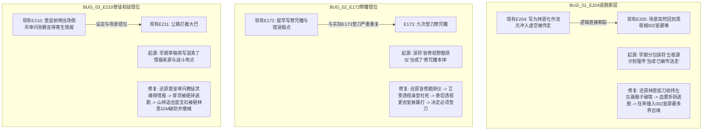
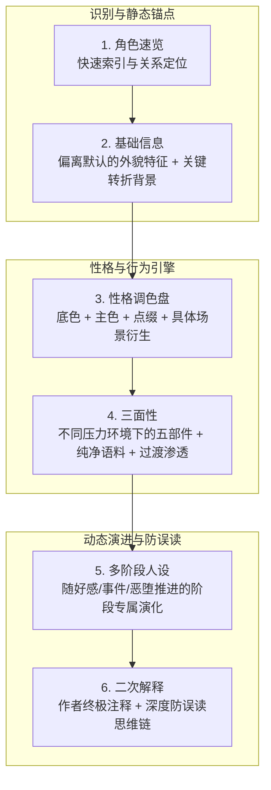
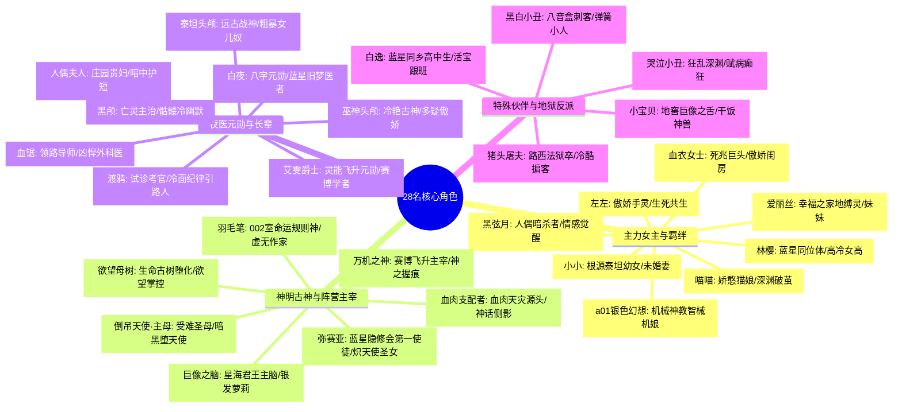
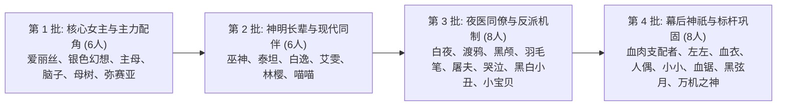
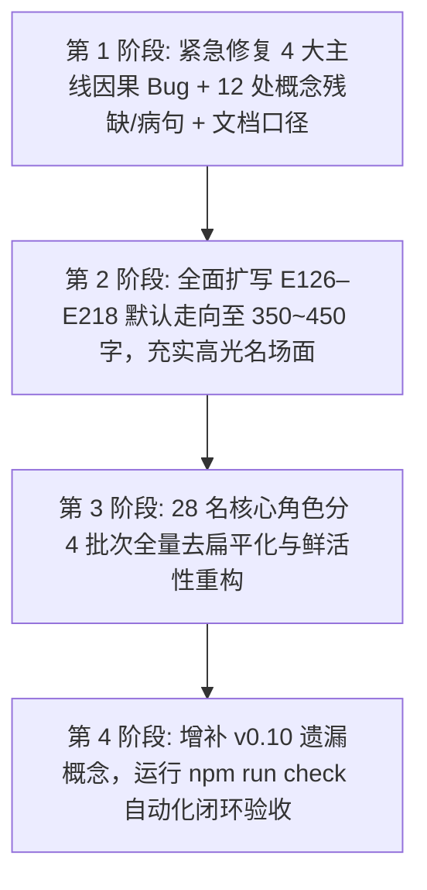

# 《诡异药剂师》角色卡 v0.10 & v0.11 全链路深度重构与修复实施总方案

本规划根据 `00-Shared` 中 25 套 Skill 规范、6 大子智能体全量审计报告以及项目最高规则（A0 Harness），系统性梳理本项目存在的所有问题、Bug 根因、原文切片参照、六组件人设标准体系、二次解释机制、28 名角色全矩阵与分阶段落地执行方案。

---

## 目录
1. [一、 本项目存在的核心问题与 Bug 根因全景剖析](#一-本项目存在的核心问题与-bug-根因全景剖析)
2. [二、 人设六组件标准体系与“二次解释”核心机制](#二-人设六组件标准体系与二次解释核心机制)
3. [三、 28 名核心角色全阵容矩阵与实装质量诊断](#三-28-名核心角色全阵容矩阵与实装质量诊断)
4. [四、 原文切片坐标与高光名场面还原指引](#四-原文切片坐标与高光名场面还原指引)
5. [五、 角色卡创作格式与质量规范（依据 00-Shared 标准）](#五-角色卡创作格式与质量规范依据-00-shared-标准)
6. [六、 28 名核心角色分批重构清单与改造方案](#六-28-名核心角色分批重构清单与改造方案)
7. [七、 分阶段落地实施路线图与验收验证计划](#七-分阶段落地实施路线图与验收验证计划)

---

## 一、 本项目存在的核心问题与 Bug 根因全景剖析

### 1. 重大因果断层与剧情错位 Bug (P0~P1)



* **【BUG-01 | P0 级】E204 传送逃脱与 E205 002室避难之逻辑断裂**
  * **路径**：`src/events/E204_多世界强制召唤与折跃逃脱.md`
  * **现象**：E204 写林恩被传送化作流光冲入虚空离开地狱，但紧接着的 E205 场景却直接出现在黑夜城 002 室等待 2 小时停战。
  * **原因与起源**：早期分包起草时漏掉了林恩反抗并狂奔躲入 002 室的原作核心转折。
  * **原文依据（第 969–970 章）**：50 多个世界大合唱定位林恩，林恩拔夜魔刀架在左左手上威胁巨像之脑“十秒内公开处决王后”，逼脑子一拳轰碎空气墙；林恩借机血雾折跃逃脱到黑夜城大街狂奔，在被拉走前撞入唯一能屏蔽定位的 002 室避难重逢羽毛笔。
  * **修复方法**：重写 E204 默认走向，恢复劫持左左破墙逃跑与撞入 002 室因果，字数扩充至 350~450 字。

* **【BUG-02 | P1 级】E172 核心剧情错位与严重失误**
  * **路径**：`src/events/E172_修瞳条件与失控的视野勘测.md`
  * **现象**：正文直接写神之方程式修复咒瞳，并提前随手列出直死看破等错误点数；下一事件引入写成 E173 测试点数；与实际的 E173（九次垫刀）严重冲突。
  * **原因与起源**：早期编排将原著第 869–871 章的“魔改视野勘测仪”误当成修咒瞳本体，并误植了自缚天使在场。
  * **原文依据（第 868–871 章）**：四大根源密谋，艾雯拿视野勘测仪给林恩盲修；艾雯戴上检索“夜医”透视女夜医澡堂社死；泰坦戴上检索“巨像”透视巨像更衣室被光溜溜的巨像之脑暴打；得出“盲修魔改率极高必须垫刀”结论。
  * **修复方法**：重写 E172 默认走向，还原盲修勘测仪社死因果，剔除自缚天使，引子纠正为“E173·九次垫刀与史诗级咒瞳复原”。

* **【BUG-03 | P1 级】E210 使徒初战场景、情报来源与武器错位**
  * **路径**：`src/events/E210_寄生兽蔓延情报与弥赛亚首战.md`
  * **现象**：写弥赛亚手持“天灯”堵在堡垒前哨，林恩当场倒吊以M审问出寄生兽去向。
  * **原文依据（第 986–990 章）**：寄生情报来自堡垒血肉教徒灵魂；弥赛亚武器是圣十字架与半身铠；初战发生在穿顶（林恩被砸碎后偷走蓝宝石逃入山林）与山林追击（蓝宝石被砸林恩以M之拳破防并藤条缴械三件套）。
  * **修复方法**：重写 E210 默认走向，还原堡垒审魂、穿顶被砸与山林追击缴械真实因果。

* **【BUG-04 | P2 级】阶段命名漂移**：`E203/E204/E210` 头部统一标为 `S29·跨界倒计时与返乡争夺`。

---

### 2. 事件默认走向字数全量不足缺陷（85 个事件违规）
- **标准要求**：每个事件词条的 `- 默认走向：` 必须严格在 **300~500 字** 区间。
- **现状统计**：
  - v0.10（E126–E170 共 45 个事件）：仅 E143（326字）达标，**44 个事件不足 300 字**（普遍在 205~289 字）；
  - v0.11 前半段（E171–E194 共 24 个事件）：仅 E187（304字）达标，**23 个事件不足 300 字**（普遍在 181~286 字）；
  - v0.11 后半段（E195–E218 共 24 个事件）：6 个达标，**18 个事件不足 300 字**（普遍在 210~288 字）。
- **危害**：字数过短导致大量极具感染力的名场面、黑色幽默台词与战斗画面被抽象概括化，AI 读取后无法还原出原汁原味的原作剧情。
- **修复方案**：全面扩写 E126–E218 中 85 个偏短事件至 **350~450 字** 标准黄金区间。

---

### 3. 概念词条残缺与关键设定遗漏 (12 处 + 增补项)

#### 🔴 【BUG-05 | P1 级】6 处末行被硬截断残缺概念（必须补全）
1. `src/concepts/C693_血衣女士蓝星身世与复仇证言.md`：第 10 行在 `任何与尹依、未成年人或年龄不明者的互动` 后硬截断。
2. `src/concepts/C697_小呀哒人质救援与康复.md`：第 4 行在 `其确切年龄未知，但幼态身份足以` 后硬截断。
3. `src/concepts/C708_三百九十一名救回者与长期康复.md`：第 10 行在 `未成年人和年龄不明者` 后硬截断。
4. `src/concepts/C718_血锯药剂店占领与复合经营据点.md`：第 10 行在 `年龄不明、幼态或受药物影响的主体` 后硬截断。
5. `src/concepts/C724_002室跨界避难与最后停战.md`：第 10 行在 `年龄不明或幼态主体` 后硬截断。
6. `src/concepts/C740_哭泣小丑与欲望母树双源污染疑云.md`：第 10 行在 `未成年人、年龄不明、幼态外形与失能主体` 后硬截断。

#### 🟡 【BUG-06 | P2 级】6 处标点与拼接语病概念
- `C704`（血娃娃）：出现 `参考。，并采用` 标点语病；
- `C712`（林恩状态）：出现 `参考。，医疗、依赖` 标点语病；
- `C719`（游魂巷清剿）：出现 `也林恩的行动由玩家主权独占` 错别字；
- `C739`（爱丽丝燕尾服）：出现文本拼接串行；
- `C742`（寄生兽传播）：出现 `失能者18岁的林恩` 漏标点粘连；
- `C749`（强迫变形）：出现 `失能主体林恩的行动` 漏标点粘连。

#### 🔵 【增补项】v0.10 关键概念词条补全清单
1. **技能类**：`【限时诅咒清除+3】`（系统强化卷轴强化参数：4次/26小时持续/13小时CD/清除根源级诅咒约35%）；`【神的方程式（合成/加工/魔改）】`。
2. **物品类**：`【小鱼形石子（喵喵兄长遗物）】`；`【小丑八音盒（狱卒权柄衍生物）】`；`【龙息之臂·魔改】`。
3. **势力与地点**：`【蓝星超自然总局】`；`【血肉神教蓝星分支】`；`【深渊第一位面与路西法城门】`。

---

## 二、 人设六组件标准体系与“二次解释”核心机制

依据 `00-Shared/tavern-cards/tavern-cards/references/contents-creation/character/` 中的 Skill 标准体系，每个核心角色必须由 **六大组件（六个文件）** 协同驱动。



### 1. 六组件核心职责与解决的 AI 问题

| 组件名称 | 规范文档路径 | 它解决 AI 的什么问题？ | 如果缺失会发生什么？ |
| :--- | :--- | :--- | :--- |
| **① 角色速览** | `character-catalog.md` | 快速辨别多角色身份与关系 | 多人同场时角色名字与身份混淆 |
| **② 基础信息** | `basic-info.md` | 锁定外貌特殊辨识点与身世起源 | 沦为千篇一律的网文万能美人/帅哥 |
| **③ 性格调色盘** | `personality-palette.md` | 给出具体场景的真实行为画面 | 沦为泛泛的抽象形容词标签（温柔/冷酷） |
| **④ 三面性** | `tri-faceted.md` | 给出不同压力下的具体台词声音与动作 | 说话没有辨识度、无法应对极端对抗 |
| **⑤ 多阶段人设** | `multi-stage.md` | 让关系和性格随剧情发生真实成长 | 玩到最后态度和刚开局一模一样 |
| **⑥ 二次解释** | `rephrase.md` | 纠偏 AI 固有认知、解释矛盾深层心理 | AI 按照预训练套路胡乱演绎 |

---

### 2. “二次解释”核心机制深度剖析（`rephrase.md`）

#### ① 核心本质：作者对角色的终极注释
* **定义**：二次解释不是指导 AI“应该怎么演”，而是作者明确告诉 AI：*“我的角色真正是这样的，不是你想的那样”*。
* **目的**：防止 AI 用预训练资料库的刻板印象（如单纯的傲娇、病娇、冷酷杀手）去补全角色，强制纠偏 AI 的理解。

#### ② 与性格调色盘的思维链联动
* 调色盘（`personality-palette.md`）定义了具体场景的行为表现；
* 二次解释对这些行为进行**“标签召回”与“二次深度思考”**，促使 AI 在生成前对角色的内在动机做思维链预判。

#### ③ 标准 YAML 格式规范：
```yaml
对角色的理解与思考:

  关于[性格点/衍生/外在表现]: |
    [剖析这个性格真正的含义是什么、它不是什么、在什么时候出现/不出现、与其他性格的关系]

  关于[另一个性格点]: |
    [剖析在极端压力或特定场景下的真实对抗与心理机制]

  总结_性格调色盘: |
    这就是[角色名]的性格调色盘，在这个调色盘上有着无数的颜色，任何时候都是由多种性格、行为、回忆组合驱动着[角色名]，并非单纯的一种颜色、一个标签。
```

---

## 三、 28 名核心角色全阵容矩阵与实装质量诊断

### 1. 28 名核心角色全景思维导图



---

### 2. 28 名角色六组件与二次解释实装现状一览表

| 梯队与类别 | 涵盖角色 (共28人) | 二次解释与六组件实装现状 | 核心待优化问题 |
| :--- | :--- | :---: | :--- |
| **🟢 第一梯队：标杆级真正实装** (约6人) | **左左、血衣女士、人偶夫人、小小、血锯、爱丽丝** | ✅ **已真正实装** | 严格按照标准采用了 YAML 格式，深入剖析了深层心理（如左左的嘴硬与照顾、血衣的母性反差）。需将三面性纯净台词由 3 句扩充至 5~8 句。 |
| **🔴 第二梯队：严重空壳化 / 写成元规则清单** (约13人) | **a01银色幻想、弥赛亚、白夜、羽毛笔、渡鸦、黑颅、猪头屠夫、哭泣小丑、黑白小丑、血肉支配者等** | ❌ **严重未实装 (挂名空壳)** | **完全没有写角色的内心与性格思考！** 仅写了 8~20 行冷冰冰的“系统约束/不详清单”，属于名不副实的空壳占位符。 |
| **🟡 第三梯队：散文化叙述 / 格式未标准化** (约9人) | **巨像之脑、欲望母树、倒吊天使(主母)、巫神头颅、泰坦头颅、白逸、林樱、小宝贝等** | ⚠️ **半实装 (未规范化)** | 写成了散文式的段落或大段剧情复述，未采用标准 YAML 键值结构，缺乏对极端对抗情境下的具体防误读剖析。 |

---

### 3. 恋爱 / 涩涩与恶堕开放状态一览

* **全开放角色（支持好感度、涩涩度、恶堕调教）**：
  * 左左（独立自我）、爱丽丝（恶堕开放）、血衣女士、黑弦月（专属情感开发度）、a01银色幻想（专属驯服/崩坏/恨意）、喵喵、小小（婚约向）、林樱、倒吊天使、巨像之脑、欲望母树、羽毛笔、弥赛亚（使徒攻略向）。
* **固定非恋爱（吸引/恶堕锁0，专注师徒/战友/长辈）**：
  * 血锯、艾雯爵士、人偶夫人、泰坦头颅、巫神头颅、白夜、渡鸦、黑颅、白逸、小宝贝、猪头屠夫、哭泣小丑、黑白小丑、万机之神、血肉支配者。

---

## 四、 原文切片坐标与高光名场面还原指引

### 1. 原文切片对照台账

| 切片包 | 对应事件 | 原文对应章节 | `角色卡设定/原文.txt` 行号区间 | 核心剧情主线 |
|:---|:---:|:---:|:---|:---|
| **v0.10 P1–P7** | E126–E170 | 第 644–863 章 | 58000 – 78747 | 六根源对峙 → 机械狂潮与巨像遗民 → 堕天使心灵深渊 → 002羽毛笔重逢 → 蓝星百鬼夜行与部分降临 → 左左离家与双生餐刀修罗场 |
| **v0.11 P1** | E171–E178 | 第 864–888 章 | 78748 – 80855 | 餐刀降温谈判 → 视野勘测仪魔改社死 → 九次垫刀修咒瞳 → 命运骰测试与1点小眼萝苏醒 → 尹依培训 → 幸福之家爱丽丝地缚复发与冷库500万悬赏口供 |
| **v0.11 P2** | E179–E186 | 第 889–913 章 | 80856 – 82523 | 蓝星旧神遗产线索 → 爱丽丝燕尾服 → 左左百日禁欲监护 → 截获十层楼高爬行者 → 寄生兽三阶段与高活性催熟 → 腔室伏击与快感冲击接管神经权限 |
| **v0.11 P3** | E187–E194 | 第 914–939 章<br>*(注: 926章缺失)* | 82524 – 84309 | 接管爬行者 → 钟塔诱袭与闫未明裂隙窥视 → 白夜汪涛故人链 → 持续污染降温 → 血锯厕所潜入 → 圈养血肉人形与迷魂铃 → 炖鸡汤下血畸藤反杀大舌头与小呀哒人质线 |
| **v0.11 P4** | E195–E202 | 第 940–964 章 | 84310 – 86104 | 五根源大殿公开处刑抓包 → 套娃炸弹踢入血色大门反爆 → 营救小呀哒与罗斯特灵魂收押 → 血衣日记揭露蓝星血仇 → 五根源强制转移冲突 → 跨界纸阵与母树神性绕行 |
| **v0.11 P5** | E203–E210 | 第 965–989 章 | 86105 – 87991 | 主母设局诱骗 → 林恩拔刀劫持左左破墙逃至大街 → 狂奔撞入002室屏蔽定位重逢羽毛笔 → 白逸血祭与蓝星双召唤降临西南防核堡垒 → 391人极限抢救 → 穿顶与山林追击破防弥赛亚缴械 |
| **v0.11 P6** | E211–E218 | 第 990–1015 章<br>*(严格止于1015章)* | 87992 – 89911 | 公路截大巴抓获血娃娃 → 突袭废水厂确认灵肉绑定与1个月休眠 → 纯白12翼显影动摇弥赛亚信仰 → 建立停车场基地 → 广播塔鲶鱼战术全城迷雾封城 → 医院王麟救父执念样本 → 金铃破雾七使徒围攻悬崖（E218 终局） |

---

### 2. 重点名场面扩写还原细目清单

1. **E136（第 750 章）**：喵喵兄长残魂以鬼力凝结小鱼石子塞给妹妹，以“哥哥去买鱼”的谎言支开喵喵后含笑消散，喵喵在废墟中痛哭。
2. **E146（第 785 章）**：林恩在诅咒清除失效下拟态银光佯攻，被堕天使黑炎长枪贯穿胸膛，抚摸羽翼轻声唤醒主母善面。
3. **E151（第 800 章）**：羽毛笔在异度空间展露数千米高流脓血肉巨神真身自卑抽泣，林恩伸出血肉触手相拥说出“我也是怪物”。
4. **E163（第 842 章）**：白逸在血泊中绝望企图向全地狱献祭堕落，林恩血肉巨手从空间裂隙猛然探出按住他脑袋冷喝“蠢货”。
5. **E170（第 863 章）**：清晨巨像之脑醒来发现抓着发烫器官全身赤裸当机，左左锁喉林恩大叫“快阉了他”，巨像之脑双眼空洞手持切肉餐刀高呼“割以永治”逼近林恩。
6. **E172（第 869–871 章）**：艾雯戴上盲修勘测仪透视女夜医澡堂社死；泰坦戴上透视巨像更衣室被光溜溜的巨像之脑暴怒追打。
7. **E204（第 969–970 章）**：50多个世界大合唱定位林恩，林恩拔夜魔刀架在左左手上威胁脑子破墙，血雾折跃逃脱到黑夜城大街狂奔撞入 002 室屏蔽定位。
8. **E210（第 987–990 章）**：堡垒审问血肉教徒灵魂得情报，穿顶撞见驱魔阵被弥赛亚砸碎，林恩偷走蓝宝石逃入山林；山林追击中弥赛亚砸碎蓝宝石，林恩以M之拳破防弥赛亚并藤条缴械。
9. **E214（第 1002 章）**：弥赛亚展现神圣十二翼净化血娃娃，林恩施展【天使之吻】展现更为纯净神圣的纯白十二翼投影，彻底震碎弥赛亚世界观。
10. **E217（第 1010–1012 章）**：未成年王麟在重度寄生下为救肺癌父亲保持清醒，林恩治好父亲癌症后王麟体内寄生虫活性反而反弹。

---

## 五、 角色卡创作格式与质量规范（依据 00-Shared 标准）

### 1. 事件词条标准模板（`event-chain-builder`）

```markdown
# 事件·SXX·EXXX·[事件标题]

- 玩家主权：<user>绝对独占林恩的对白、动作、判断、心理、记忆与决定；默认走向仅供因果推演参考。
- 阶段：SXX·[阶段名称]
- 地点：[具体场景名称，如：幸福之家冷库 / 离魂街钟塔]
- 前置条件：[如：硬前置：EXXX完成且……]
- 参与者与动机：
  - [角色名]：[动机与行动目标]
- 默认走向：[核心正文：字数严格控制在 350~450 字之间。包含起因、名场面动作、对白、波折与结果，严禁出现第X章、阶段几等元数据词汇]
- 紧迫度：[高/中/低]
- 幕后停止点：[具体停止瞬间]
- 变形条件：[玩家介入导致的合理分支]
- 完成条件：[事件判定完成的客观标志]
- 取消条件：[事件取消的客观条件]
- 结果影响：[对世界状态、角色关系、后续线索的具体影响]
- 系统提示：[给 AI 的运行约束提示]

---

### 下一事件引入（EXXX·[下一事件标题]）
- 触发时机：[触发条件]
- 剧情引子：[自然过渡的生动描写]
- 预兆写法：[具体预兆表现]
- 承接因果：[两事件之间的逻辑纽带]
```

---

### 2. 概念词条标准八段式模板（`tavern-cards`）

```markdown
# 概念·[类别]·[标题]（事件[EXXX, EXXX...]）

- 类别：[如：机制／生物／物品／势力]
- 事实门槛：[触发或了解该概念的前置事实条件]
- 定义：[精准客观的本质定义]
- 来源：[E编号来源，如：E183, E212]
- 机制：[详尽的工作机理、运行逻辑、数据参数（字数无上限）]
- 限制与代价：[副作用、消耗、使用限制、反噬]
- 未知项：[当前版本尚未解密的悬念，严禁脑补]
- 禁止外推：[严格的边界隔离红线，如：禁止推导胜负、禁止将医疗当成同意等]
```

---

### 3. 人设词条六组件标准模板（`character/` 系列规范）

#### ① `基础信息.md`
- **外貌特征**：仅写偏离 AI 默认认知的特征（如“左眼角下有一颗泪痣”、“颈部有永久凹陷握痕”），**严禁“容颜绝美、身材婀娜”等万能美人修辞**。
- **背景信息**：仅写“删掉这条背景角色会不会变”的关键人生转折事件。

#### ② `性格调色盘.md`
- **结构**：底色（最深层基调）+ 主色调（日常最突出1-2个）+ 点缀（特定条件隐藏性格0+个）+ **具体场景衍生（核心）**。
- **衍生写作铁律**：写具体场景、动作和画面，不写抽象定义。每个性格色彩至少 2-3 个生动衍生。

#### ③ `三面性.md`
- **结构**：2~4 张面，每张面必须齐备 **五部件** + **过渡与渗透**。
  1. **触发条件**：何时启动此面？
  2. **能量状态**：精力消耗高/低/稳定度？
  3. **纯净语料台词**：**5~10 句纯对话台词**（严禁混入动作/表情/心理描写！）。
  4. **身体行为模式**：肢体动作与神态习惯。
  5. **功能**：这张面在保护什么？解决什么问题？
- **过渡与渗透**：面与面切换的渐变过程，以及运行中泄漏的真实瞬间。

#### ④ `二次解释.md`
- **结构**：标准 YAML 格式（`对角色的理解与思考: -> 关于[性格点]: -> 总结_性格调色盘:`）。
- **内容**：深入剖析极端压力情境下的对抗反应与真实心理，纠偏 AI 固有认知。

---

## 六、 28 名核心角色分批重构清单与改造方案



### 第一批：核心女主与主力配角标准化改造（急需，共 6 人）

| 角色名 | UID | 当前评级 | 核心缺陷 | 重构与鲜活性改造方案 |
|:---|:---:|:---:|:---|:---|
| **爱丽丝** | 102 | ❌ 缺失/骨架 | 仅21行，写成流水账机器，缺失调色盘衍生与五部件。 | 底色确立为“对家人与被需要的至死执念”；补全吃糖舔舐、修补黑线等生动衍生；三面性重构为：①地缚游魂·引路执事、②天真幼妹·依恋日常、③死兆恶灵·碎体护兄；补齐每面 5-10 句纯净台词与 YAML 二次解释。 |
| **a01银色幻想** | 293 | ❌ 扁平/过时 | 沿用表层/深层/隐藏旧格式，隐藏面写“不详”，二次解释写成元规则清单。 | 调色盘充实数据算计与集群娇喘死机衍生；三面性重写为：①肃正执行者·神罚机娘、②逻辑崩坏·快感俘虏、③誓杀宿敌·偏执复仇；补齐 5-10 句台词与标准 YAML 二次解释。 |
| **倒吊天使(主母)** | 280 | ❌ 扁平/过时 | 充斥“容颜圣洁端庄到了极致”万能美人修辞；三面性无五部件与台词。 | 剔除万能美人修辞，突出受难倒吊与铜钉贯穿；调色盘补充掩嘴轻笑与护短黑化衍生；三面性重写为：①天穹受难·神圣主母、②圣堂私语·偏爱教母、③深渊裂隙·堕天使黑化；补齐神圣/黑化台词 5-10 句。 |
| **巨像之脑** | 290 | ❌ 扁平/散文 | 散文化叙述，无调色盘键值结构，三面性无台词语料。 | 调色盘结构化为女王傲娇与幼态依恋衍生；三面性重构为：①超导主脑·歼星女王、②双生银萝·依恋幼主、③红光过载·量子暴走；补齐 5-10 句傲娇毒舌台词（“愚蠢的碳基脑袋…”）。 |
| **欲望母树** | 295 | ❌ 扁平/散文 | 纯散文总结，三面性无台词与五部件。 | 调色盘规范化为生命古树本源与欲望掌控衍生；三面性重写为：①繁衍主宰·妖媚母神、②生命古树·求索知音、③根系狂化·血肉天灾；补齐 5-10 句古神台词与标准 YAML 二次解释。 |
| **弥赛亚** | 298 | ❌ 缺失/骨架 | 仅16行，三面性无台词与五部件，二次解释缺失。 | 调色盘充实圣光天灯与被倒吊以M破防的羞耻娇颤衍生；三面性重写为：①白银圣女·光明代行、②良知动摇·悲悯守护、③圣光破防·倒吊娇羞；补齐 5-10 句圣女/娇羞台词。 |

---

### 第二批：神明长辈与现代同伴升级（共 6 人）

| 角色名 | UID | 当前评级 | 核心缺陷 | 重构与鲜活性改造方案 |
|:---|:---:|:---:|:---|:---|
| **巫神头颅** | 230 | ❌ 扁平/过时 | 大段散文叙述，三面性沿用表层/深层/隐藏旧格式。 | 调色盘补充蛇发嘶鸣布阵、以M破防满面羞红自我催眠衍生；三面性重写为：①上古巫神·冷酷主宰、②傲娇主母·自我催眠、③绝境血祭·万魂禁咒；补齐 5-10 句冷傲台词。 |
| **泰坦头颅** | 220 | ❌ 扁平/过时 | 粗暴女儿奴设定鲜明但文本未结构化，三面性无台词。 | 调色盘拆分断颈触手狂轰机甲、捧着小小等衍生；三面性重写为：①远古战神·狂暴天灾、②女儿奴·铁汉柔情、③神魔血仇·灭世天劫；补齐 5-10 句豪放台词（“老子生撕了他！”）。 |
| **白逸** | 200 | ❌ 扁平/过时 | 逗比高中生描写未结构化，三面性无台词。 | 调色盘拆分抱大腿哭嚎、抛硬币召唤等生动衍生；三面性重构为：①逗比同乡·气氛担当、②神医跟班·赤诚盟友、③绝境血性·少年战狂；补齐 5-10 句现代热梗台词。 |
| **艾雯爵士** | 240 | ❌ 扁平/过时 | 描写过于拘谨，三面性无五部件。 | 调色盘充实灵能飞升AI的孤独守望与学术探讨衍生；三面性重构为：①仪式塔主·赛博导师、②九字元勋·暗影执政、③飞升残影·旧时代遗孤；配齐 5-10 句严谨灵能台词。 |
| **林樱** | 205 | ❌ 扁平/过时 | 高冷女高标签化，三面性无五部件与台词。 | 调色盘补充冷冽理性、触碰记忆闪回与递手帕的隐秘温柔；三面性重构为：①高冷学生·戒备疏离、②冷静急救·求知追查、③同位感应·记忆共鸣；配齐 5-10 句现代台词。 |
| **喵喵** | 104 | 🟡 良好 | 三面性台词仅2句，缺少详细身体动作模式。 | 保持优良人设，将三面性台词扩充至 5-8 句纯净台词；补充踩奶、炸毛、撕裂皮囊等具体动作与渗透细节。 |

---

### 第三批：夜医同僚与反派机制角色丰满化（共 8 人）

| 角色名 | UID | 当前评级 | 重构方案 |
|:---|:---:|:---:|:---|
| **白夜** | 260 | ❌ 缺失 | 调色盘重构为背负旧梦的痛苦行医者；三面性重构为：①考核考官·严苛元勋、②旧梦残影·执念医者、③战地元勋·铁血护航；配齐 5-10 句沧桑台词。 |
| **渡鸦** | 263 | ❌ 缺失 | 调色盘确立冷面引路人极致纪律；三面性重写为：①试诊考官·冷酷核查、②瘟疫封锁·战地指挥、③夜医信徒·秩序服从；配齐 5-10 句台词。 |
| **黑颅** | 265 | ❌ 缺失 | 调色盘充实亡灵女夜医骨骼冷幽默；三面性重写为：①试诊考官·严密核验、②亡灵主治·灵魂剖析、③短暂生者·旧梦回响；配齐 5-10 句台词。 |
| **羽毛笔** | 297 | ❌ 缺失 | 调色盘充实虚无作家的改写狂热与吃小鱼干慵懒；三面性重构为：①安静书桌·怪谈执笔、②随性编织·命运观测、③神格展开·虚无作家；配齐 5-10 句台词。 |
| **猪头屠夫** | 210 | ❌ 缺失 | 调色盘重构为路西法狱卒的字面履约；三面性重写为：①血肉厨师·刀俎主宰、②冷酷掮客·字面履约、③幕后执棋·命运教育；配齐 5-10 句阴郁台词。 |
| **哭泣小丑** | 275 | ❌ 缺失 | 调色盘充实狂乱深渊癫狂嘲弄；三面性重构为五部件，配齐 5-10 句疯批自语台词与认知扭曲行为。 |
| **黑白小丑** | 276 | ❌ 缺失 | 调色盘充实弹簧小人阴暗潜伏；三面性重写为五部件，配齐 5-10 句阴冷嘲弄台词。 |
| **小宝贝** | 250 | ❌ 扁平 | 调色盘充实干饭神兽尊严与挑食；三面性重构为：①地窖巨舌·警觉取食、②契约坐骑·狂暴狂舔、③神兽伙伴·撒娇共鸣；配齐动作语料。 |

---

### 第四批：幕后神祇规范化与标杆巩固（共 8 人）

1. **血肉支配者 (UID 296)**：消除生硬的“不详”空壳，规范为“神话侧影”：调色盘确立吞噬畸变与血肉天灾神性；三面性规范为教团神祇·万物血祭/根源巨头·暗夜博弈/利维坦之主·天灾降临。
2. **标杆角色巩固（左左、血衣女士、人偶夫人、小小、血锯、黑弦月、万机之神）**：将各面台词由 2-4 句统一扩充至 5-8 句标准区间，补齐过渡与渗透细节。

---

## 七、 分阶段落地实施路线图与验收验证计划



### 1. 第 1 阶段：紧急修复主线因果与概念残缺（约 12 个文件）
- [ ] 重写 `E172.md`（还原盲修视野勘测仪澡堂与更衣室社死名场面，纠偏骰点与自缚天使）；
- [ ] 重写 `E204.md`（还原劫持左左破墙逃脱大街并在被拉走前撞入 002 室因果，平滑衔接 E205）；
- [ ] 重写 `E210.md`（还原堡垒审问教徒灵魂得情报、穿顶初遇被砸碎、山林追击破防弥赛亚缴械三件套）；
- [ ] 修正 `E203/E204/E210` 阶段命名为 `S29`；
- [ ] 补全 C693、C697、C708、C718、C724、C740 末行截断内容；
- [ ] 修复 C704、C712、C719、C739、C742、C749 标点语病；
- [ ] 同步 `AGENTS.md`、`创作规划.yaml`、`system.md`、`world.md` 中的 28 人口径，清理说教模板句。

### 2. 第 2 阶段：全面扩写 E126–E218 默认走向（共 85 个事件）
- [ ] **v0.10（E126–E170）44 个偏短事件**：扩写至 350~450 字，重点充实 E126（六根源对峙）、E136（喵喵兄长诀别）、E146（林恩刺胸唤主母）、E151（羽毛笔相拥）、E163（按头救白逸）、E170（双生餐刀修罗场）；
- [ ] **v0.11 前半段（E171–E194）23 个偏短事件**：扩写至 350~450 字，重点充实 E171（餐刀谈判）、E174（六点全城动乱）、E180（燕尾服）、E188（钟塔窥视闫未明）、E192（血锯厕所潜入）；
- [ ] **v0.11 后半段（E195–E218）18 个偏短事件**：扩写至 350~450 字，重点充实 E195（五根源大殿公开抓包）、E196（套娃炸弹反爆）、E203（主母诱骗）、E207（祭场解救）、E214（12翼显影）、E216（封城辩论）。

### 3. 第 3 阶段：28 名核心角色分批重构（共 28 目录，168 个组件文件）
- [ ] **第 1 批（核心女主）**：重构爱丽丝、银色幻想、倒吊天使(主母)、巨像之脑、欲望母树、弥赛亚；
- [ ] **第 2 批（长辈同伴）**：升级巫神头颅、泰坦头颅、白逸、艾雯爵士、林樱、喵喵；
- [ ] **第 3 批（夜医反派）**：丰满白夜、渡鸦、黑颅、羽毛笔、猪头屠夫、哭泣小丑、黑白小丑、小宝贝；
- [ ] **第 4 批（神祇与标杆）**：规范血肉支配者，巩固左左、血衣、人偶夫人、小小、血锯、黑弦月、万机之神。

### 4. 第 4 阶段：概念增补与构建验收
- [ ] 新增技能（限时诅咒清除+3）、道具（小鱼形石子、小丑八音盒、龙息之臂魔改）、势力（蓝星超自然总局、血肉神教蓝星分支）等词条；
- [ ] 运行构建与离线断言检查：
  ```powershell
  cd "角色卡本体/诡异药剂师_MVU_v0.11(测试中"
  npm run check
  ```
- [ ] 确认 21,000+ 项静态断言全部 100% 绿灯通过，EJS 0 语法错误，产物哈希更新。

---

> **结语**：本方案为《诡异药剂师》角色卡提供了彻底根治历史遗留缺陷、实现“让任何 AI 读取后均能 100% 完整还原原作所有剧情与鲜活人设”的完整工程蓝图。
